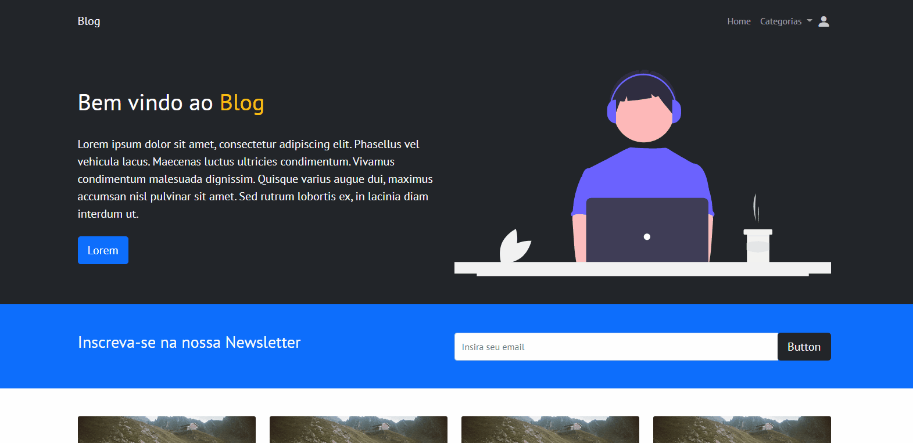

# Sistema de Blog

<!---Esses são exemplos. Veja https://shields.io para outras pessoas ou para personalizar este conjunto de escudos. Você pode querer incluir dependências, status do projeto e informações de licença aqui--->

> Este projeto é baseado em um sistema de blog, com publicação de artigo e criação de categoria. Foi usado o Node.js no backend e no frontend foi usado o bootstrap.

### Ajustes e melhorias

O projeto ainda está em desenvolvimento e as próximas atualizações serão voltadas nas seguintes tarefas:

- [ ] Visualização e data dinâmicas na home
- [ ] Deletar/Editar usuario admin
- [ ] Envio de email
- [ ] Seção artigo aprimorada

## ☕ Veja o projeto

[Demonstração em video do blog - Home](https://youtu.be/Rzz6wRRc9FQ)

[Demonstração em video do blog - Admin](https://youtu.be/AzWGDN_F7cY)

## 📫 Tecnologias

- Node.js
- Express.js
- MySql
- Sequelize
- Bootstrap

## 📝 Licença

Esse projeto está sob licença. Veja o arquivo [LICENÇA](LICENSE.md) para mais detalhes.